[Jamf Pro Active Directory Certificate Services Connector]{dir="ltr"}

**[DRAFT 1 - in progress]{dir="ltr"}**

[20 October 2019/ol]{dir="ltr"}

[Contents]{dir="ltr"}

[Options for Deploying Device Certificates 1]{dir="ltr"}

[ADCSC -- Background]{dir="ltr"} [2]{dir="ltr"}

[Network Connections]{dir="ltr"} [3]{dir="ltr"}

*[Network Zones and Firewall Configuration]{dir="ltr"}* *[3]{dir="ltr"}*

[Security Mindset]{dir="ltr"} [4]{dir="ltr"}

*[Introduction]{dir="ltr"}* *[4]{dir="ltr"}*

*[ADCSC Communication Authentication and Trust Basis]{dir="ltr"}* *[4]{dir="ltr"}*

*[ADCSC and IT Service Security]{dir="ltr"}* *[4]{dir="ltr"}*

*[Microsoft DCOM Binding Requirement]{dir="ltr"}* *[5]{dir="ltr"}*

[Requirements Summary]{dir="ltr"} [6]{dir="ltr"}

[Installing the Jamf ADCS Connector]{dir="ltr"} [7]{dir="ltr"}

*[1. Download a copy of the installer]{dir="ltr"}* *[7]{dir="ltr"}*

*[2. Run the installer]{dir="ltr"}* *[7]{dir="ltr"}*

*[3. Give ADCS Connector permission to talk to the CA]{dir="ltr"}* *[9]{dir="ltr"}*

*[Creating a Certificate Template in ADCS and Granting Template Permissions]{dir="ltr"}* *[11]{dir="ltr"}*

*[Artifacts]{dir="ltr"}* *[15]{dir="ltr"}*

*[Resulting Configurations]{dir="ltr"}* *[16]{dir="ltr"}*

[ADCS Connector Customizations]{dir="ltr"} [21]{dir="ltr"}

*[Introduction]{dir="ltr"}* *[21]{dir="ltr"}*

*[Installation Script Customization]{dir="ltr"}* *[21]{dir="ltr"}*

*[Requirements for Reverse Proxy, Load-Balanced, and Web Application Firewall Network Configuration]{dir="ltr"}* *[22]{dir="ltr"}*

[Use a Domain Service Account when Authenticating to ADCS]{dir="ltr"} [23]{dir="ltr"}

*[Introduction]{dir="ltr"}* *[23]{dir="ltr"}*

[Configuring IIS to use an alternate Server Certificate]{dir="ltr"} [25]{dir="ltr"}

*[Introduction]{dir="ltr"}* *[25]{dir="ltr"}*

*[Obtaining a Certificate Signing Request]{dir="ltr"}* *[25]{dir="ltr"}*

*[Configuring a Previously-Provisioned Server Identity]{dir="ltr"}* *[26]{dir="ltr"}*

*[Replacing a server certificate in IIS prior to expiration]{dir="ltr"}* *[26]{dir="ltr"}*

[Configuring IIS to use an alternate Client Certificate]{dir="ltr"} [27]{dir="ltr"}

[Options for Deploying Device Certificates]{dir="ltr"}
------------------------------------------------------

[There are four standard methods for deploying device certificates to devices. The one you use will depend on your circumstances.]{dir="ltr"}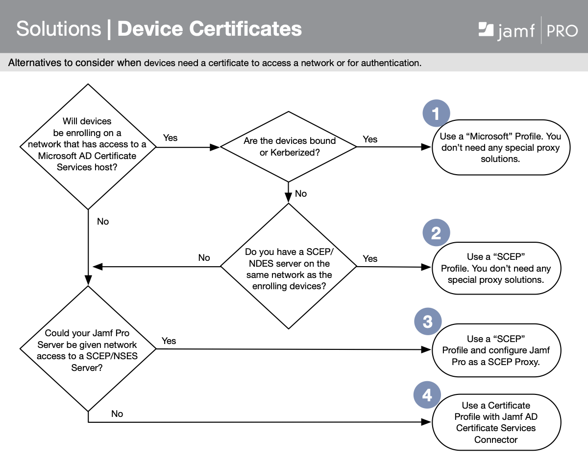{width="6.489444444444445in" height="5.069878608923885in"}

[Options 1 and 2 are traditional methods that require devices to enroll on an internal network. Options 3 and 4 work where enrolling devices are not initially on an internal network.]{dir="ltr"}

[Option 3 allows the devices to use Jamf Pro as a conduit for their transaction with a SCEP/Microsoft NDES service, and since the trust basis for all components is strong, this is often both acceptable and desirable, because in option 4, Jamf Pro creates the private key for the device, gets it signed by ADCS, and sends it to the device. In all other options, the private key is created by the enrolling device and never leaves the device.]{dir="ltr"}

[Some organizations prefer the native ADCS interface over SCEP because they prefer the certificate-based authentication between Jamf Pro and the Jamf ADCS Connector.]{dir="ltr"}

[The remainder of this document deals with the Jamf Active Directory Services Connector and assumes that you have already determined that this option is the best fit for your situation.]{dir="ltr"}

[ADCSC -- Background]{dir="ltr"}
--------------------------------

[The Jamf Pro Active Directory Certificate Services Connector (\"ADCS Connector\" or \"ADCSC\") is an HTTP REST API running on a Microsoft IIS web server. It acts as an intermediary between Jamf Pro and Microsoft Active Directory Certificate Services (\"ADCS\"), submitting certificate requests to ADCS on behalf of Jamf Pro and returning completed signatures. Network communications, ports, protocols, and authentication are described in the following sections.]{dir="ltr"}

[This diagram summarizes the managed device certificate deployment process using ADCS Connector.]{dir="ltr"}

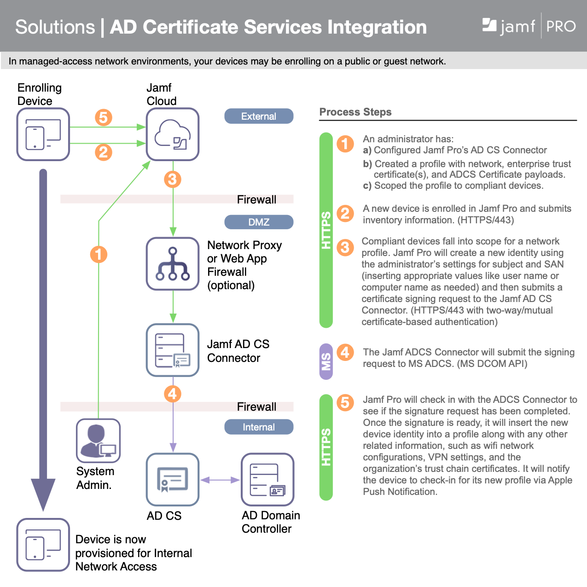{width="6.492916666666667in" height="6.492916666666667in"}

[Network Connections]{dir="ltr"}
--------------------------------

[The following diagram illustrates a common implementation where the ADCS Connector is deployed in an organization\'s DMZ and connects to an internal CA.]{dir="ltr"}{width="6.458333333333333in" height="1.6798326771653542in"}

#### [Network Zones and Firewall Configuration]{dir="ltr"}

[The ADCSC communications are encrypted and authenticated, but additional security is obtained by creating firewall rules in your network infrastructure and/or on the server/OS firewall.]{dir="ltr"}

[The source IP addresses from which Jamf Cloud connections will originate are documented by]{dir="ltr"} [[[https://www.jamf.com/jamf-nation/articles/409/permitting-inbound-outbound-traffic-with-jamf-cloud]{.underline}](https://www.jamf.com/jamf-nation/articles/409/permitting-inbound-outbound-traffic-with-jamf-cloud).]{dir="ltr"}

[The host names, internal and external (VIP) IP addresses, or port numbers used in your internal networks can be configured as needed. Port 443 is commonly used for HTTPS connections. DCOM (Microsoft Distributed Component Object Model) connections between the ADCS Connector server and the ADCS server run on Microsoft\'s default ports (135 and 49152-65535), though those can be configured as well. Ref:]{dir="ltr"} [[[https://support.microsoft.com/en-us/help/832017/service-overview-and-network-port-requirements-for-windows\#method4]{.underline}]{dir="ltr"}](https://support.microsoft.com/en-us/help/832017/service-overview-and-network-port-requirements-for-windows#method4)

  ---------------------------------------------------- ------------------------------------------------------------ ----------------------------- ------------------------------------------------------------------------------------------------------------------------------------------------------------------------------------------------------------------------------
  [Connection]{dir="ltr"}                              [TCP Port (Typical)]{dir="ltr"}                              [Protocol]{dir="ltr"}         [Description]{dir="ltr"}
  [Managed Devices to Jamf Pro]{dir="ltr"}             [443]{dir="ltr"}                                             [HTTPS]{dir="ltr"}            [Apple OS-devices connect to an enrolled mobile device management (\"MDM\") server to receive management payloads.]{dir="ltr"}
  [Jamf Pro to Jamf AD CS Connector]{dir="ltr"}        [443]{dir="ltr"}                                             [HTTPS]{dir="ltr"}            [Jamf Pro sends certificate signing requests and retrieves completed signatures by opening a connection to the Jamf AD CS Connector, typically on TCP port 443, but any available port can be used if preferred.]{dir="ltr"}
  [Jamf ADCS Connector to Microsoft ADCS]{dir="ltr"}   [135: MS DCE endpoint resolution used by DCOM.]{dir="ltr"}   [Microsoft DCOM]{dir="ltr"}   [The Jamf AD CS Connector uses Microsoft Distributed Component Object Model (DCOM) to communicate with AD CS.]{dir="ltr"}
                                                       [49152-65535: Dynamic DCOM callback ports]{dir="ltr"}                                      
  ---------------------------------------------------- ------------------------------------------------------------ ----------------------------- ------------------------------------------------------------------------------------------------------------------------------------------------------------------------------------------------------------------------------

[Security Mindset]{dir="ltr"}
-----------------------------

#### [Introduction]{dir="ltr"}

[In many organizations, certificates are deployed to devices for use in verifying that devices or users which connect to internal networks are authorized to do so, and to allow network administrators to track who is connecting, when they connect, and which services they connect to. In other organizations, the certificate is used to authenticate to applications or for message signing. The security around the identity provisioning process must be considered in the context of the rights that identity confers and measured against the trust-basis of the provisioning process.]{dir="ltr"}

[Regardless of the identity purpose, certain best-practices should be employed. These are discussed here.]{dir="ltr"}

#### [ADCSC Communication Authentication and Trust Basis]{dir="ltr"}

  ----------------------------------------- --------------------------------------------------------------------------------- ------------------------------------------------------------------------------------------------------------------------------------------------------------------------------------------------------------------------------------------------------------------------------------------------------------------------------------------------------------------------------------
  [Relationship]{dir="ltr"}                 [Authentication]{dir="ltr"}                                                       [Trust Basis]{dir="ltr"}
  [Devices to Jamf Pro]{dir="ltr"}          [Message signing based on a device-specific MDM enrollment identity]{dir="ltr"}   [This depends on the enrollment method, but for Automated Enrollment, 1) Device has been purchased by the organization and registered by Apple in Apple Business Manager or Apple School Manager, 2) An admin has accepted the device into a Jamf Pre-stage Enrollment Group, 3) The device user has authenticated with their organizational credentials on enrollment]{dir="ltr"}
  [Jamf Pro to ADCS Connector]{dir="ltr"}   [Server and Client TLS certificate exchange]{dir="ltr"}                           [A Jamf Pro administrator will have uploaded the server\'s public key and the Jamf Pro ADCS Client Identity file into the Jamf Pro console. Without these, no connection to ADCSC is possible.]{dir="ltr"}
  [ADCSC to ADCS]{dir="ltr"}                [Microsoft Auth (Kerberos)]{dir="ltr"}                                            [The ADCS administrator has granted permission to obtain certificates to the entity as whom the ADCS Connector will authenticate.]{dir="ltr"}
  ----------------------------------------- --------------------------------------------------------------------------------- ------------------------------------------------------------------------------------------------------------------------------------------------------------------------------------------------------------------------------------------------------------------------------------------------------------------------------------------------------------------------------------

#### [ADCSC and IT Service Security]{dir="ltr"}

[No IT service can have perfect security. The goal of security practitioners should be to ensure that services are planned, implemented, and operated in a manner that minimizes risk. The security around the ADCS Connector is will be similar to the good security practices an organization uses with any of their network-based services.]{dir="ltr"}

[Administrators must have a strong understanding of the trust-basis, network connections, protocols, encryption, and authentication at each step of a communications flow.]{dir="ltr"}

[Vulnerabilities in the operating systems underlying an IT service are among the most frequently exploited attack vectors. Your installation should rely on the vendor\'s recommended practices and the vendor\'s updates should be applied diligently. ]{dir="ltr"}

[Jamf patches related to security are uncommon, but action should be taken immediately in response to security notifications when the vulnerability effects a component or workflow that you are using. These will be sent to all customers via email and also posted prominently on Jamf Nation. Jamf Cloud Standard customers are patched automatically. On-premise installations should be patched without undue delay. ]{dir="ltr"}

[Strategies such as reverse proxies and firewalls can be used to insulate network components from attack. Proxies should be employed in a fashion that is consistent with your organization\'s standards and practices. Firewalls may be enforced to allow only the minimum required connections between network zones and at the OS level. ]{dir="ltr"}

[Security plan approval workflows, audits, or informal methods such as peer configuration review and testing can be used to verify that systems are implemented correctly.]{dir="ltr"}

[Anything downloaded or installed on a server should be sourced directly from a trusted vendor. For example, we would not install a network traffic monitoring utility downloaded from an untrusted repository onto a production server. ]{dir="ltr"}

[Never use a web browser on a server to do anything unnecessary. If you need to look up some information when troubleshooting, do it from your user machine. ]{dir="ltr"}

[Strong measures should be taken to protect credentials such as private keys and service-account user names and passwords in transit and at rest. For example, we would never send user account information/passwords or a .pfx keystore and it\'s password together in an email or copy them to a local user machine. The chain of custody of private keys should be carefully protected.]{dir="ltr"}

[Remote Desktop and ssh access to a server (and any management servers) should be limited only to trusted and required persons. ]{dir="ltr"}

[Practices such as key/password rotation may be used to limit the amount of time that exposed credentials may be used to penetrate a system. Two-factor authentication ensures that exposure of a single  factor (i.e. username/password) is not sufficient to gain access. ]{dir="ltr"}

[Avoid the use of local administrator accounts on Windows servers. Domain accounts with password complexity, lockout rules, and expiration are preferred. ]{dir="ltr"}

[Use certificate-based authentication for ssh, not username and password. ]{dir="ltr"}

[These are meant to illustrate general principles of server operation. More specific actions are generally available from network, server, monitoring, and OS vendors. These should be employed as they are with other IT services hosted by your organization. ]{dir="ltr"}

#### [Microsoft DCOM Binding Requirement]{dir="ltr"}

[The standard installer will configure a thread pool to run the ADCS Connector in IIS. By default, it runs under the ADCSC\'s host computer\'s Windows auth identity, and this identity will need to be given permissions on the CA. For this reason, the server running the Connector host must be bound either to the same domain as ADCS, or to a forest domain that has a trust relationship with the ADCS domain. The Connector can also be configured to run as another user, such as a service account. This will be discussed later in the document.]{dir="ltr"}

[Requirements Summary]{dir="ltr"}
---------------------------------

[The following preparations should be made prior to installation:]{dir="ltr"}

[A Windows OS with .NET Framework 4.5 or greater (E.g. Windows Server 2016/2019) joined to a domain that has a trust basis with the ADCS domain.]{dir="ltr"}

[Port 443 open inbound from Jamf Pro to the ADCS Connector host.]{dir="ltr"}

[DCOM ( Microsoft Distributed Component Object Model) permitted between the ADCS Connector host and the ADCS server. Ports 135 and 49152-65535 are the MS defaults.]{dir="ltr"}

[The DNS used by Jamf Pro can resolve the FQDN of your ADCS Connector. E.g., if you are on Jamf Cloud, The FQDN of the Connector\'s external VIP is available in public DNS.]{dir="ltr"}

[Installing the Jamf ADCS Connector]{dir="ltr"}
-----------------------------------------------

#### [1. Download a copy of the installer]{dir="ltr"}

[If you are a Jamf customer, the installation software is available under the \"My Assets\" section once you have logged into Jamf Nation.]{dir="ltr"}

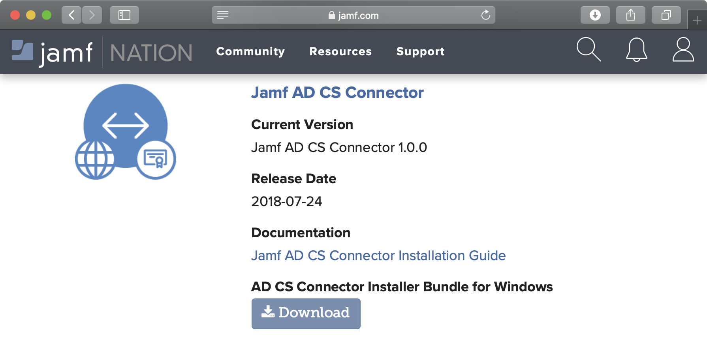{width="6.489444444444445in" height="3.1685892388451444in"} [ ]{dir="ltr"}

[Copy the installer to the computer that will host the ADCS Connector and decompress the .zip archive.]{dir="ltr"}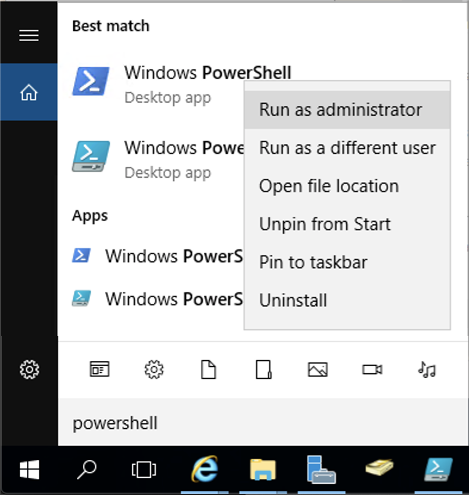{width="2.813667979002625in" height="2.9674015748031497in"} [ ]{dir="ltr"}

#### [2. Run the installer]{dir="ltr"}

[The installer includes a Powershell script that can be called from the Windows command line or Powershell command line to unzip the ADCS Connector files and setup/configure Microsoft IIS.]{dir="ltr"}

[Run the the Windows PowerShell command line as administrator, \"cd\" into the folder that contains the deploy.ps1 script, and run the installer. For the -fqdn parameter, specify the host name Jamf Pro will resolve to connect to the Connector. Note that this is the external/VIP hostname, not necessarily the same as the actual host that runs the Connector. For -jamfdn, use your Jamf Pro host name. See the next page for an example.]{dir="ltr"}

[The documentation is available from]{dir="ltr"} [[[http://docs.jamf.com/ad-cs-connector/1.0.0/index.html]{.underline}](http://docs.jamf.com/ad-cs-connector/1.0.0/index.html).]{dir="ltr"}

[The operation will be similar to the following:]{dir="ltr"}

[PS \> cd \"C:\\Users\\admin\\Desktop\\ADCS Connector\"]{dir="ltr"}

[PS C:\\Users\\admin\\Desktop\\ADCS Connector\> .\\deploy.ps1 -fqdn adcsc.my.org -jamfProDn my.jamfcloud.com]{dir="ltr"}

[Enabling IIS and ASP.NET features\...]{dir="ltr"}

[IIS and ASP.NET enabled.]{dir="ltr"}

[Removing AdcsProxyPool Application Pool\...]{dir="ltr"}

[Removing AdcsProxy Site\...]{dir="ltr"}

[Install path C:\\inetpub\\wwwroot\\adcsproxy already exists.]{dir="ltr"}

[Cleaning C:\\inetpub\\wwwroot\\adcsproxy\...]{dir="ltr"}

[Unzipping site to C:\\inetpub\\wwwroot\\adcsproxy\...]{dir="ltr"}

[Creating AdcsProxyPool Application Pool\...]{dir="ltr"}

[Creating site AdcsProxy\...]{dir="ltr"}

[Creating local user account AdcsProxyAccessUser. This user will be referenced for IIS Client Certificate Mapping Authentication.]{dir="ltr"}

[Created new local user AdcsProxyAccessUser with password \^\\::X\"+Y\#bb8Wh?rC8lh]{dir="ltr"}

[!!!NOTE - Please save this information if setting up IIS Client Certificate Mapping Authentication manually.]{dir="ltr"}

[Adding Windows Firewall rule to allow inbound TCP traffic on port 443]{dir="ltr"}

[Configuring HTTPS\...]{dir="ltr"}

[Generating self-signed certificate for ms.jamf.club\...]{dir="ltr"}

[Adding adcsc.my.org to local root CA store\...]{dir="ltr"}

[Generating adcsc.my.org-signed certificate for j\...]{dir="ltr"}

[Configuring IIS Client Certificate Mapping Authentication for AdcsProxyAccessUser\...]{dir="ltr"}

[Exporting client certificate keystore\...]{dir="ltr"}

[Client keystore exported.]{dir="ltr"}

[!!!NOTE - Client cert keystore password: c2sG5J5orHM3ZLP]{dir="ltr"}

[Make note of the Client cert keystore password. You\'ll be prompted to enter this password when importing the client identity file (\"client-cert.pfx\") to Jamf Pro. If you close the Powershell window before noting the password, you\'ll need to re-run the installer to get a new identity generated.]{dir="ltr"}

[ ]{dir="ltr"}

#### [3. Give ADCS Connector permission to talk to the CA]{dir="ltr"}

[The Connector is ready to accept certificate requests and pass them on to ADCS, but if you do, you\'ll get \"CR\_DISP\_DENIED\" errors because we haven\'t told ADCS it can accept requests from the Connector.]{dir="ltr"}

[Run certsrv or or select \"Certification Authority\" from Server Manger\'s Tools menu. You can also load it as an mmc snap-in.]{dir="ltr"}

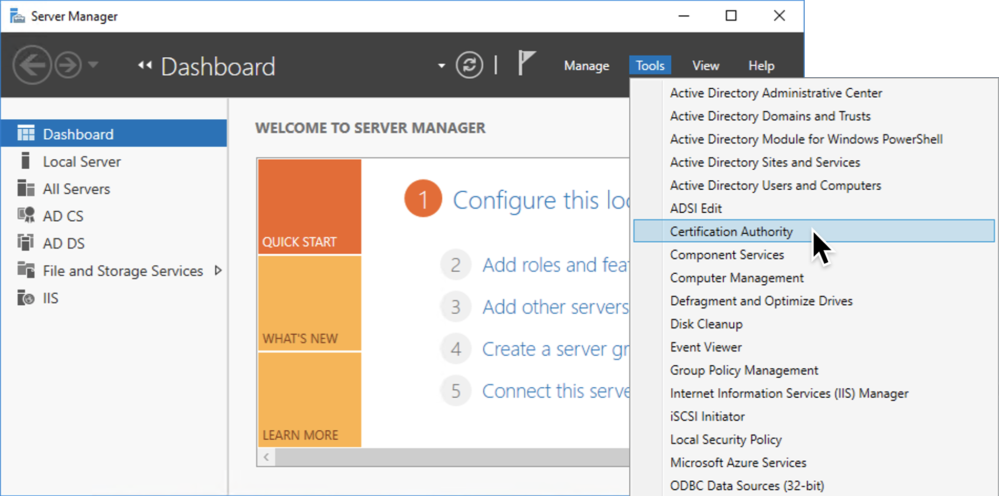{width="6.5in" height="3.226078302712161in"}

[Right click on your CA\'s name and select \"Properties\...\".]{dir="ltr"}

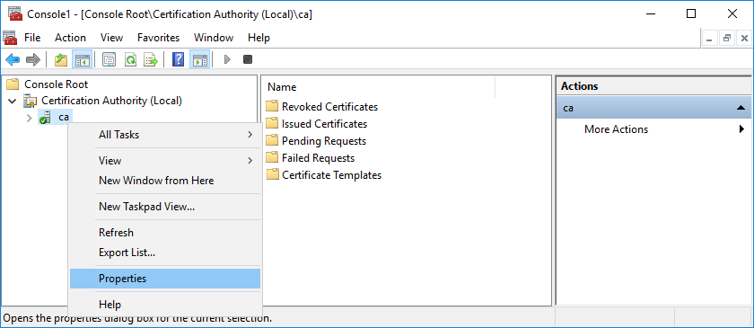{width="6.5in" height="2.8244050743657043in"}

[Switch to the \"Security\" tab and click the \"Add\...\" button.]{dir="ltr"}

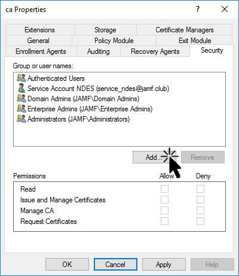{width="4.2118766404199475in" height="4.854187445319335in"}

[Make sure \"Computers\" is in the list of selectable object types, If it\'s not, use the \"Object Types\...\" button to add it. Then add the server that\'s running ADCS Connector and click \"OK\".]{dir="ltr"}

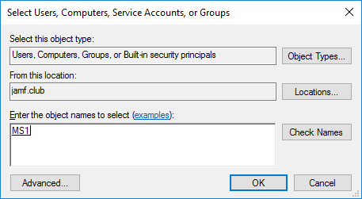{width="4.217527340332459in" height="2.3164107611548554in"}

[The Connector Host should have \"Request Certificates\" permissions. It also needs \"Read\" permissions, but in this example they are inherited via Authenticated Users.]{dir="ltr"}

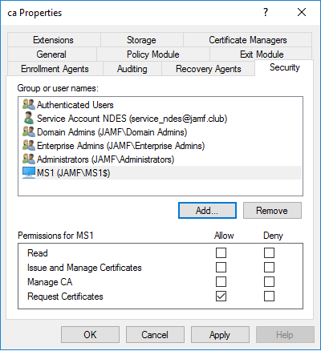{width="3.7614566929133857in" height="4.118794838145232in"} [ ]{dir="ltr"}

#### [Creating a Certificate Template in ADCS and Granting Template Permissions]{dir="ltr"} 

[If you are running a Stand-Alone CA, you are done configuring permissions. If you use an Enterprise CA, you will likely need to also configure a certificate template.]{dir="ltr"}

[If your existing CA already has a template that is being used to deploy certificates to a bound device, you may be able to use that template with ADCS Connector as it already has all the settings needed for your organization\'s use of device/user identities. However, in most cases, this template will have been configured to set the certificate subject to the identity of the entity that is requesting a certificate. When that entity is a computer or user connecting to ADCS using Windows Auth, that works fine. In our case, however, the identity of the enrolling computer is from the ADCS Connector, which means if you used a built-in template like \"Users\" or another you\'ve derived from it, every certificate deployed by the connector, while unique, would have the Connector\'s host name in the certificate subject, not the name of the device or user for whom for whom we are actually provisioning the certificate.]{dir="ltr"}

[To correct this, we will create a new template with a setting to allow the certificate subject to be specified in the certificate request.]{dir="ltr"}

[Using a separate template dedicated to use by the Jamf ADCS Proxy will also help the CA admin to pick out the Apple templates when they look at the Issued/Failed lists in their ADCS console.]{dir="ltr"}

[Certificate templates are managed using the Certificate Templates Console. In certsrv, right-click on \"Certificate Templates\" and select \"Manage\" from the contextual menu to run the template console. You can also access Certificate Templates Console as mmc snap-in or by running certtmpl.msc directly.]{dir="ltr"}

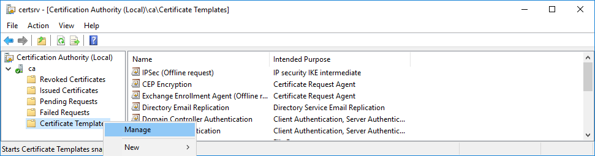{width="6.5in" height="1.7070034995625547in"}

[You could create a new template from scratch, but it\'s usually easier to duplicate an existing known-good template \-- typically the same one you are already using successfully to provision certificates for domain-bound devices. Right-click the source template to duplicate it.]{dir="ltr"}

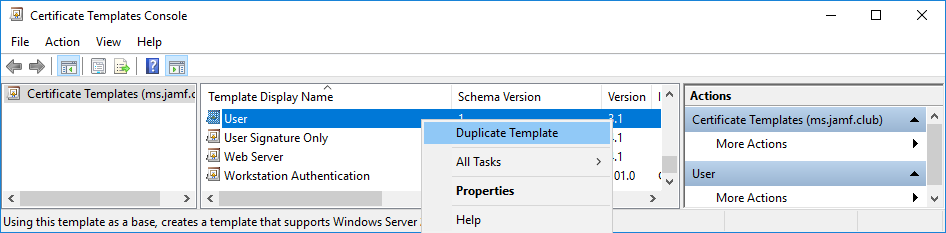{width="6.5in" height="1.6009514435695538in"}

[A certificate properties editor dialog will appear. In the \"General\" tab, give it a name consistent with whatever naming standard your CA admin prefers. Make a careful note of the name or paste it into an email/document. You\'ll to enter the exact name when you are configuring Jamf Pro to provision certificates. Note that it\'s the \"[Template Name]{.underline}\" we need to specify, not the display name.]{dir="ltr"}

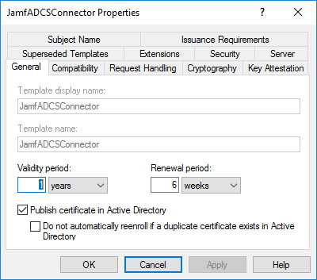{width="2.670009842519685in" height="2.3562839020122484in"}

[In the \"Security\" tab, add the ADCS Connector host, just as you did at the CA-level and grant the \"Enroll\" permission. (In this example, we did not need to grant the read permission because it is inherited.) Because we are going to allow the certificate subject to be determined in the request, we must [remove]{.underline} the permission for authenticated users. This is important because we do not want to advertise this template to users. Some organizations will also remove \"Authenticated Users\" in favor of explicitly allowing each individual CA host.]{dir="ltr"}

{width="3.045161854768154in" height="3.540001093613298in"} [ ]{dir="ltr"} {width="3.0161482939632545in" height="3.5439741907261593in"}

[In the \"Subject Name\" tab, allow the request to be supplied in the request. You will see a warning when you make this change. ADCS shows this because it has no way of knowing that we\'re configuring a Certificate Proxy and that we have disabled access to domain users.]{dir="ltr"}

{width="3.118141951006124in" height="3.6482261592300964in"} [ ]{dir="ltr"} {width="3.0561887576552933in" height="1.2348239282589677in"}

[Click \"OK\" to exit the setup.]{dir="ltr"}

[Now that we have created the certificate template, we need to tell the CA that it\'s available. Go back to the certsrv Certificate Authority console and right-click on \"Certificate Templates\" and select \"New\>Certificate Templates to Issue\".]{dir="ltr"}

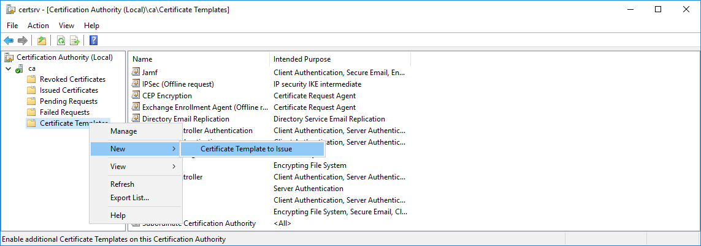{width="6.5in" height="2.2917760279965003in"} [ ]{dir="ltr"}

[Select the template you created for the Connector and click \"OK\".]{dir="ltr"}

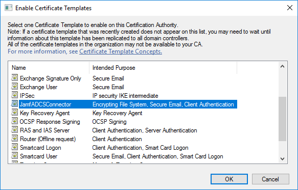{width="3.090062335958005in" height="1.9770034995625547in"} [ ]{dir="ltr"}

[The template is now added to the CA\'s list of issuing templates.]{dir="ltr"}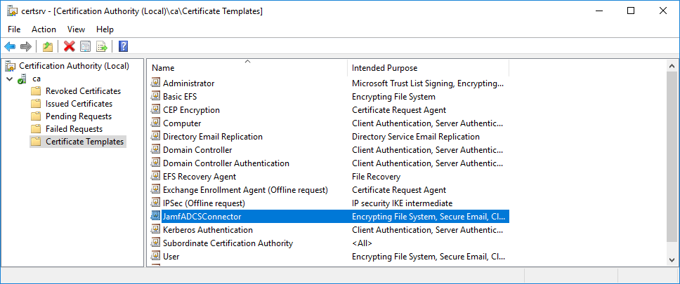{width="6.5in" height="2.7195253718285213in"} [ ]{dir="ltr"}

#### [Artifacts]{dir="ltr"} 

[At the completion of the installation process, you will have the following ready for configuration in Jamf Pro:]{dir="ltr"}

[The adcs-proxy-ca.cer file, the public key of the Connectors TLS Server certificate]{dir="ltr"}

[The client-cert.pfx file, the keypair Jamf Pro will use to authenticate to the Connector]{dir="ltr"}

[The password needed to unlock the client-cert.pfx file.]{dir="ltr"}

[The template name. (Again\... *not the display name*, unless they happen to be the same.)]{dir="ltr"}

[Instructions for Jamf Pro Configuration are available in the Jamf Pro product documentation.]{dir="ltr"}

####  

#### [Resulting Configurations]{dir="ltr"}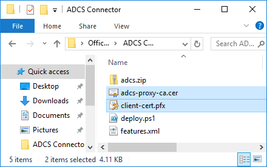{width="3.25in" height="2.03125in"}

[You now have everything you need to configure the ADCS Connector in Jamf Pro. In the working directory from which you ran the script, you now have two new files.]{dir="ltr"}

[adcs-proxy-ca.cer is the public key for the identity that IIS will use when negotiating TLS when Jamf Pro tries to connect. If the server uses an identity that doesn\'t match up with this public key, Jamf Pro will not trust the server and the TLS handshake will fail.]{dir="ltr"}

[Even more importantly, the ADCS Connector needs to know that the connecting client is authorized. The client-cert.pfx file is the keypair that Jamf Pro will need to present in order to successfully authenticate to IIS and reach the Connector application. This file is protected by a random password, which is shown at the end of the deploy.ps1 script\'s output (shown with orange highlight in the example above).]{dir="ltr"}

[If we launch a web browser, we can see that IIS has been installed.]{dir="ltr"}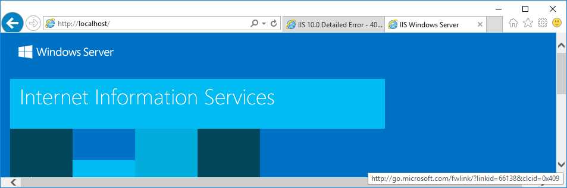{width="6.5in" height="2.162120516185477in"} [ ]{dir="ltr"}

[If we attempt to browse to the Connector and accept the self-signed server certificate warning, we will get an authentication error, showing that anonymous auth is disabled.]{dir="ltr"}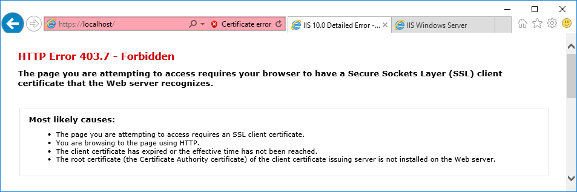{width="6.5in" height="2.162120516185477in"} [ ]{dir="ltr"}

[In IIS Manger, we observe that a new application pool has been created for the ADCS Connector. The ADCS Connector site will run within this pool. We see that the Connector is running as \"ApplicationPoolIdentity\", an identity derived from the local computer\'s bind to the domain. This is why we gave the computer certificate enrollment permissions on the CA and the template we created.]{dir="ltr"}

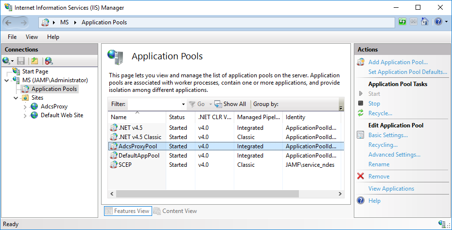{width="6.5in" height="3.3059142607174103in"}

[Under Sites, we\'ll see the corresponding site. It\'s listening for https on port 443.]{dir="ltr"}

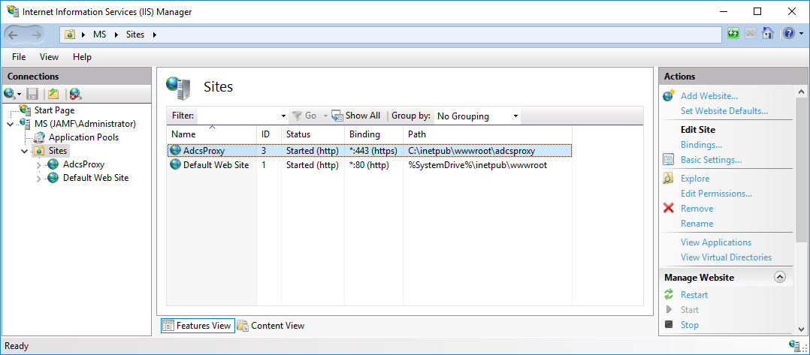{width="6.5in" height="2.8520417760279964in"}

[In bindings, we see that the TLS certificate subject matches the FQDN we will tell Jamf to resolve when it connects.]{dir="ltr"}

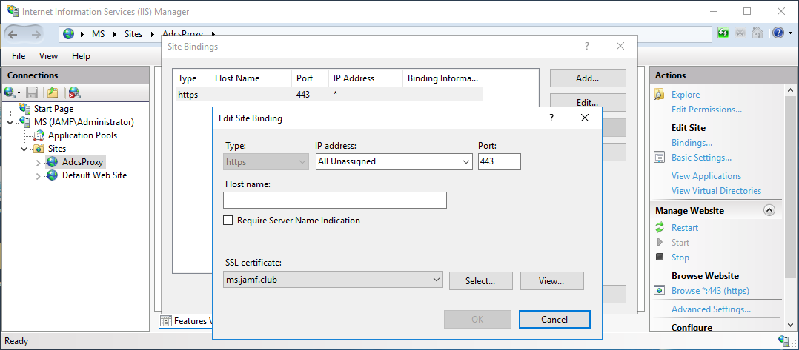{width="6.5in" height="2.8520417760279964in"}

[Under SSL Settings, we see that IIS will require SSL connections and that connecting computers present a client certificate for authentication.]{dir="ltr"}

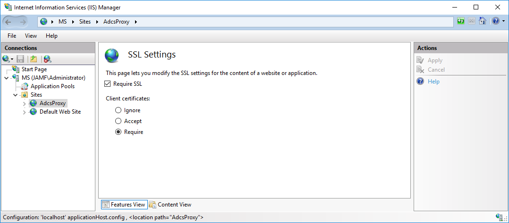{width="6.5in" height="2.8520417760279964in"}

[To review client certificate authentication settings, go to Configuration Editor.]{dir="ltr"}

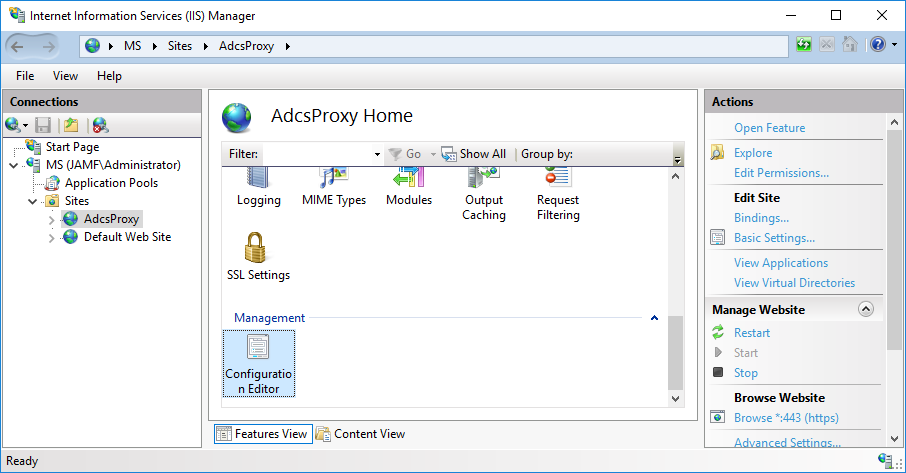{width="6.5in" height="3.3934886264216972in"}

[Navigate to \"system.webServer \> security \> authentication \> iisClientCertificateMappingAauthentication\" in the \"Section\" drop-down menu.]{dir="ltr"}

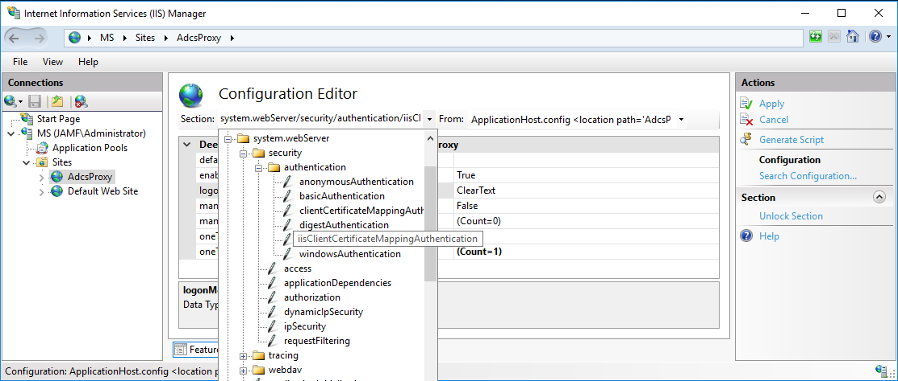{width="6.5in" height="2.7681944444444446in"}

[Highlight oneToOneMappings and click the \"\...\" Button to the right of the configuration entry.]{dir="ltr"}

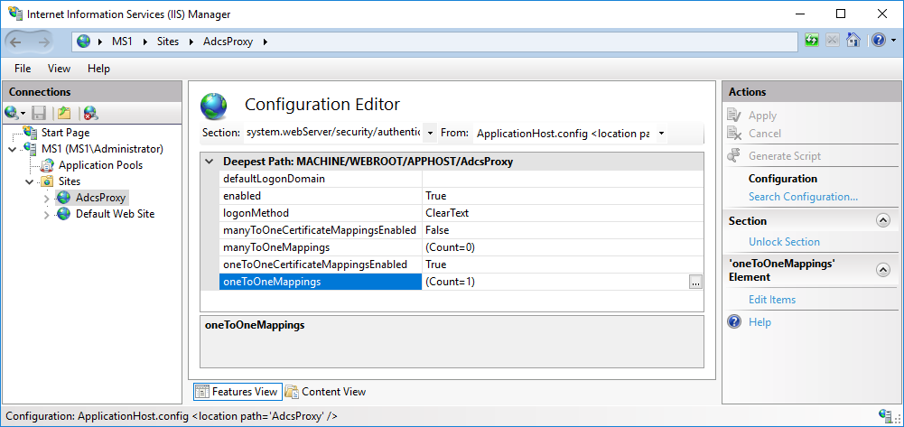{width="6.5in" height="3.0714293525809273in"}

[The editor will display the settings for client configuration. The certificate value is the base-64 public key for the client identity. It is used to ensure a valid identity is being used to negotiate TLS. The username and password indicate the user that will be authenticated to IIS when a valid certificate is presented.]{dir="ltr"}

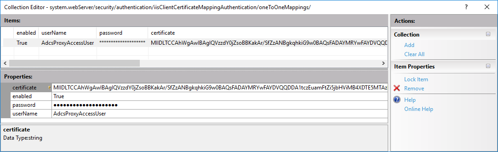{width="6.5in" height="1.9986154855643046in"}

+-------------------------------------------------------------------------------------------------------------------------------------------------+
| **[File Location Notes:]{dir="ltr"}**                                                                                                           |
|                                                                                                                                                 |
| [*IIS Configuration Settings:* C:\\Windows\\System32\\inetsrv\\config\\applicationHost.config]{dir="ltr"}                                       |
|                                                                                                                                                 |
| [*IIS Connection Logs:* C:\\inetpub\\logs\\LogFiles]{dir="ltr"}                                                                                 |
|                                                                                                                                                 |
| [Note: You\'ll see multiple folders here, one for each site ID. You can get ADCSC\'s IIS site ID from the site list in IIS Manager.]{dir="ltr"} |
+-------------------------------------------------------------------------------------------------------------------------------------------------+

[ADCS Connector Customizations]{dir="ltr"}
------------------------------------------

#### [Introduction]{dir="ltr"}

[Common questions about the implementation of ADCS Connector include:]{dir="ltr"}

[Can we adjust things like the port used in IIS or the expiration date on the identities the installer script generates?]{dir="ltr"}

[Can it run in a load-balanced configuration to support high availability?]{dir="ltr"}

[Can it run behind a reverse proxy or web application firewall to insulate it from other network zones?]{dir="ltr"}

[Can we use our own server and/or client TLS identities?]{dir="ltr"}

[We will discuss these customization options in the sections that follow.]{dir="ltr"}

#### [Installation Script Customization]{dir="ltr"}

[The installation script is written in PowerShell. Many Windows admins will already be familiar with this scripting language. The parameters section at the top of the script identifies available configuration options such as port, host names, etc. These are mainly used when we install the Connector on an existing IIS server already running other applications or sites.]{dir="ltr"}

[param (]{dir="ltr"}

[    \[switch\]\$help = \$false,]{dir="ltr"}

[    \[string\]\$archivePath = \".\\adcs.zip\",]{dir="ltr"}

[    \[string\]\$installPath = \"C:\\inetpub\\wwwroot\\adcsproxy\",]{dir="ltr"}

[    \[string\]\$hostPath = \"\",]{dir="ltr"}

[       \[int\]\$bindPort = 443,]{dir="ltr"}

[    \[switch\]\$installIIS = \$true,]{dir="ltr"}

[    \[switch\]\$cleanInstall = \$true,]{dir="ltr"}

[    \[string\]\$appPool = \"AdcsProxyPool\",]{dir="ltr"}

[    \[string\]\$siteName = \"AdcsProxy\",]{dir="ltr"}

[    \[switch\]\$configureHttps = \$true,]{dir="ltr"}

[    \[string\]\$fqdn = \'\',]{dir="ltr"}

[    \[string\]\$jamfProDn = \'\']{dir="ltr"}

[ )]{dir="ltr"}

[Some other configurations are easy to adjust in the script. For example, if we have an IT security rule that all service-to-service client certificates will have a validity period of one year, we would locate the client certificate line in the script and change the \"10\" to a \"1\". If you do this, set up a calendar invite to your team well ahead of the expiration so you can schedule a change to update the identity. Otherwise the system will break with the expiration is reached.]{dir="ltr"}

[\$clientCert = New-SelfSignedCertificate \`]{dir="ltr"}

[-CertStoreLocation cert:\\localmachine\\my -DnsName \"\$jamfProDn\" \` ]{dir="ltr"}

[-KeyExportPolicy Exportable \`]{dir="ltr"}

[-KeyUsage DigitalSignature, DataEncipherment,KeyEncipherment \`]{dir="ltr"}

[-Signer \$cert \`]{dir="ltr"}

[-NotAfter (Get-Date).AddYears(10)]{dir="ltr"}

#### [Requirements for Reverse Proxy, Load-Balanced, and Web Application Firewall Network Configuration]{dir="ltr"}

[The Connector will be implemented in many different IT environments, each with different network layouts and practices for service deployment. Some of these will mandate high-availability, reverse proxy, or web application firewall configurations. The understanding needed to implement any of these is similar. They all work well with the Connector. Network administrators only need to understand that ADCSC is an HTTPS web site running on IIS, no different than any other web services in an organization, and that it implements one-to-one client certificate authentication.]{dir="ltr"}

[The implications are:]{dir="ltr"}

[The server certificate used by the proxy, load balancer, or web application firewall when negotiating TLS must have a name or SAN that matches the host name configured in Jamf Pro and must also match the public key configured in Jamf Pro.]{dir="ltr"}

[When a proxy or load balancer is configured for TCP pass-through, the client certificate presented by Jamf Pro will be passed on transparently to the ADCS Connector where it\'s authenticity will be verified.]{dir="ltr"}

[When a proxy, load balancer, or web application firewall is configured for TLS interception, the proxy should use the public key of Jamf Pro\'s client certificate to verify the authenticity of the Jamf Pro connection. Organizations can use whatever means they prefer to authenticate the connection between the proxy and IIS (e.g. NTLM) so long as both ends of the connection are configured in tandem. If certificate based authentication is used, the proxy and IIS will be set to require client certificate authentication and the proxy will use the identity whose public key has been set to verify the client certificate in IIS. This may or may not be the same client certificate used by Jamf Pro to connect to the proxy.]{dir="ltr"}

[When a load balancer is used, the same rules for server and client certificate authentication apply. There\'s no limit to the number of ADCS Connector/IIS instances that can be in a load-balanced server pool. However, you should understand that the certificate signing process in ADCS has two-steps. First, a signing request is submitted, and then a subsequent connection is made to retrieve the finished signature. ADCS will only allow retrievals by the same identity that made the request. The implication here is that if load-balanced Connectors are running with the default AppPool identity, you should use a primary/failover configuration for high availability. (The load on the connector will never be high enough to require true load balancing.) If you want to use methods like round-robin or least-load, you\'ll need to set the app pool identity on all Connectors in the cluster to use the same domain service account. Then any Connector instance will be able to collect signatures generated by any other.]{dir="ltr"}

[The critical understanding here is that ADCSC is front-ended by Microsoft IIS. ADCSC itself is not involved in any way in negotiating network connections, TLS, or authentication. Customers may route the HTTP/TCP traffic to their Connector in any fashion that is supported by IIS and consistent with their own standards and practices. The configuration steps will be based on the documentation from your proxy\'s manufacturer and Microsoft\'s IIS documentation.]{dir="ltr"}

[Use a Domain Service Account when Authenticating to ADCS]{dir="ltr"}
---------------------------------------------------------------------

#### [Introduction]{dir="ltr"}

[The default installation requires that the ADCS Connector host be given rights to ADCS. Some organizations may prefer to use a domain services account instead.]{dir="ltr"}

[Be sure the implications of this change are well understood before making changes. Ref:]{dir="ltr"} [[[https://docs.microsoft.com/en-us/iis/manage/configuring-security/ensure-security-isolation-for-web-sites]{.underline}]{dir="ltr"}](https://docs.microsoft.com/en-us/iis/manage/configuring-security/ensure-security-isolation-for-web-sites)

[The service account will typically be configured with User cannot change password and Password never expires. In this example, the user name is \"AdcsProxyAccessUser\".]{dir="ltr"}

[Then, return to the CA configuration console and give the user \"Request Certificates\" permission in the CA Security properties, and then go to the Template Configuration console to give it enrollment permission on the template.]{dir="ltr"}

{width="2.167212379702537in" height="2.8368864829396325in"} [ ]{dir="ltr"} {width="2.109846894138233in" height="2.832468285214348in"} [ ]{dir="ltr"} {width="2.022073490813648in" height="2.830903324584427in"}

[Then we can run the Connector as our service account and it will replace the Connector host as the identity that authenticates to ADCS. Highlight the ADCSProxyPool and click \"Advanced Settings\".]{dir="ltr"}

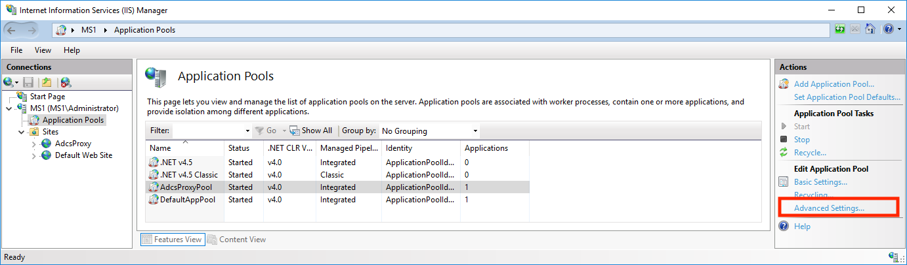{width="6.5in" height="1.9095516185476815in"}

[Highlight the \"Identity\" setting and click the \"\...\" button to the right of the current setting\... applicationPoolIdentity. Use the \"Set\...\" button in the dialog to switch to a custom account and enter your service account\'s \<domain\\\>username and password. Click the OK button and you will see your change listed in Advanced Settings. Use the OK button to close the dialog.]{dir="ltr"}

{width="2.1458781714785653in" height="2.6725043744531933in"} [ ]{dir="ltr"} {width="1.9114774715660543in" height="2.676068460192476in"} [ ]{dir="ltr"} {width="2.149879702537183in" height="2.6774879702537184in"}

[Configuring IIS to use an alternate Server Certificate]{dir="ltr"}
-------------------------------------------------------------------

#### [Introduction]{dir="ltr"}

[The following basic steps are used to install a server identity for IIS:]{dir="ltr"}

[Run the ADCSC deploy script.]{dir="ltr"}

[Obtain a new server identity from your preferred source.]{dir="ltr"}

[Install your identity on the IIS server.]{dir="ltr"}

[Configure the IIS site to use that identity instead of the one created by the ADCSC installation script. To do so, select the AdcsProxy Site in IIS Manger and click \"Bindings\...\".]{dir="ltr"}

#### [Obtaining a Certificate Signing Request]{dir="ltr"}

[Your CA administrator or public certificate vendor will often ask that you provide a Certificate Signing Request (\"CSR\"). If you create this on the IIS server, the private key for the identity will remain on the server, so this is often the preferred workflow. There are many utilities for creating CSRs, including one built into IIS that is often used.]{dir="ltr"}

[Highlight the server name in IIS Manager and click \"Sever Certificates\".]{dir="ltr"}\
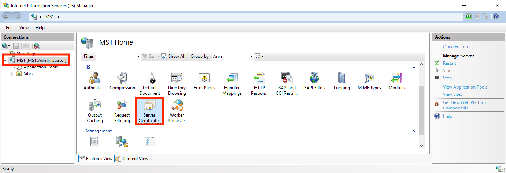{width="6.210166229221348in" height="2.125476815398075in"}

[Open the \"Create Certificate Request\" Wizard under \"Actions\".]{dir="ltr"}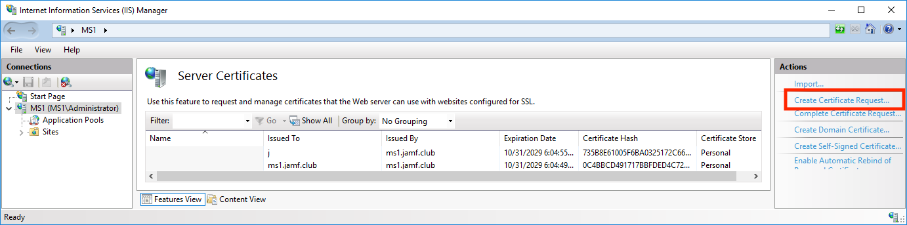{width="6.227182852143482in" height="1.5455314960629922in"}[\
]{dir="ltr"}

[The Wizard will walk you through the rest of the process for configuring and saving the CSR. The Common Name (CN) will be the host name that Jamf Pro connects. In the case of Jamf Cloud configurations, this is the external DNS (\"VIP\") that resolves to your external IP address. Use the default Microsoft RSA SChannel Cryptographic Provider and a bit length of at least 2048.]{dir="ltr"}

#### [Configuring a Previously-Provisioned Server Identity]{dir="ltr"}

[If you already have the server identity .pfx that you want to install, add it to the Windows certificate store using the Certificates mmc snap-in, then highlight the ADCS Proxy site in IIS Manager, and click \"Bindings\...\"]{dir="ltr"}

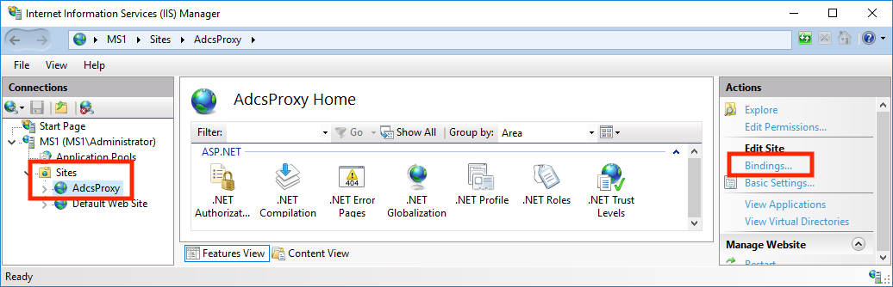{width="6.5in" height="2.095559930008749in"}

[Edit the https binding and select the desired certificate from the SSL certificate drop-down menu.]{dir="ltr"}

{width="3.1941141732283467in" height="1.9091961942257218in"} [ ]{dir="ltr"} {width="3.2075284339457566in" height="1.9172134733158355in"}

[If your identity have root or intermediate certificates in its trust chain that were not included in the .pfx file you added to the Windows certificates store, you\'ll need to add them as well.]{dir="ltr"}

#### [Replacing a server certificate in IIS prior to expiration]{dir="ltr"}

[You should replace your IIS server certificate prior to expiration. If you don\'t, Jamf Pro may no longer be able to negotiate TLS connections once the expiration date has passed. The steps to follow are the same as the initial installation. You can install a new certificate any time you want and it doesn\'t matter if it\'s an update of the the existing certificate or you create a brand new one\... the only requirement is that the public key that is uploaded in the ADCS Connector PKI entry in Jamf Pro matches the server identity.]{dir="ltr"}

####  

[Configuring IIS to use an alternate Client Certificate]{dir="ltr"}
-------------------------------------------------------------------

[If you have another identity file (.pfx or .p12) that you want to use to authenticate Jamf Pro to ISS, you will need to use its public key in IIS\'s Client Certificate Mapping configuration. You can use Windows\' certificates utility to export the public key. Open Computer Certificates (\"certlm\"), locate the client certificate you want to use, right-click on the identity and select \"All Tasks \> Export\...\".]{dir="ltr"}

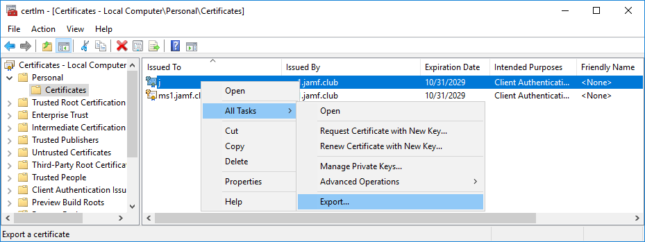{width="6.5in" height="2.4418733595800526in"}

[The wizard will step you through the export process. Do not export the private key. Select the Base-64 export format.]{dir="ltr"}

{width="3.0490540244969377in" height="1.5615715223097113in"} [ ]{dir="ltr"} {width="3.234009186351706in" height="1.55957895888014in"}

[Open the exported .cer file and copy the section between the BEGIN and END lines.]{dir="ltr"}

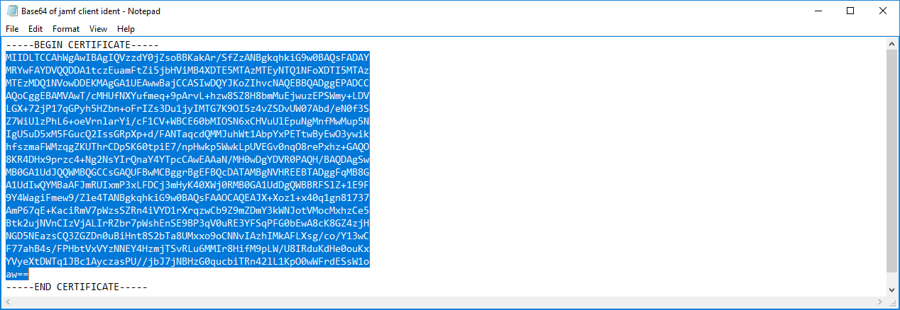{width="6.5in" height="2.245269028871391in"}

[The instructions and screen shots for navigating to IIS\'s client certificate authentication configuration were demonstrated in \"To review client certificate authentication settings\...\" in the above section where installation script configurations were discussed. You can use the configuration editor screen to paste the base-64 of the new key to replace the one created by the installer.]{dir="ltr"}

[Alternately, you can edit the IIS configuration file manually.]{dir="ltr"}

[Navigate to \"C:\\Windows\\System32\\inetsrv\\config\\applicationHost.config\" and make a backup copy before making any changes.]{dir="ltr"}

[Run NotePad (or another text editor) as Administrator, change the file filter to \"All Files\" and navigating to the IIS applicationHost configuration file.]{dir="ltr"}

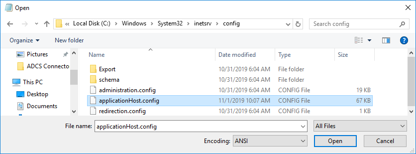{width="6.5in" height="2.4025120297462816in"}

[Replace the existing base-64 key with the contents you coped from the .der document and remove any carriage returns to the key is one contiguous string.]{dir="ltr"}

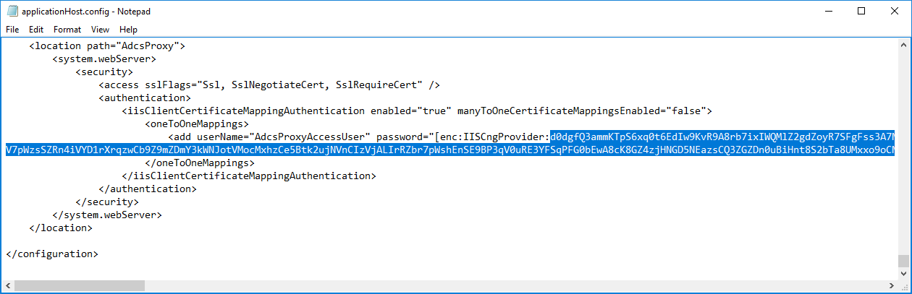{width="6.5in" height="2.0996041119860016in"}

[Save the configuration file and restart IIS.]{dir="ltr"}
